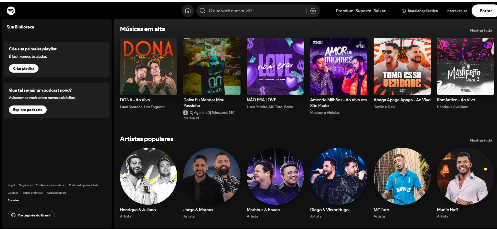

# 🎵 Spotify - Music Clone 🎧

Bem-vindo ao **Spotify - Music Clone**, um projeto inspirado na interface do Spotify, criado para explorar conceitos de desenvolvimento web moderno. Aqui você pode visualizar artistas populares e álbuns em alta, com uma interface estilosa e interativa!

## 🚀 Funcionalidades

- **Artistas Populares**: Exibição de artistas com imagens e nomes.
- **Álbuns em Alta**: Mostra os álbuns mais ouvidos, com capa, título e artista.
- **Sidebar Interativa**: Navegação com opções como biblioteca, playlists e podcasts.
- **Barra de Pesquisa**: Pesquise o que você deseja ouvir.
- **Banner Promocional**: Teste o Premium de graça com um banner fixo.

## 🛠️ Tecnologias Utilizadas

- **HTML5**: Estrutura semântica do projeto.
- **CSS3**: Estilização responsiva e moderna.
- **JavaScript**: Manipulação dinâmica do DOM.
- **Font Awesome**: Ícones para melhorar a interface.

### Referência

https://www.youtube.com/watch?v=1jvxxoW_1TM
